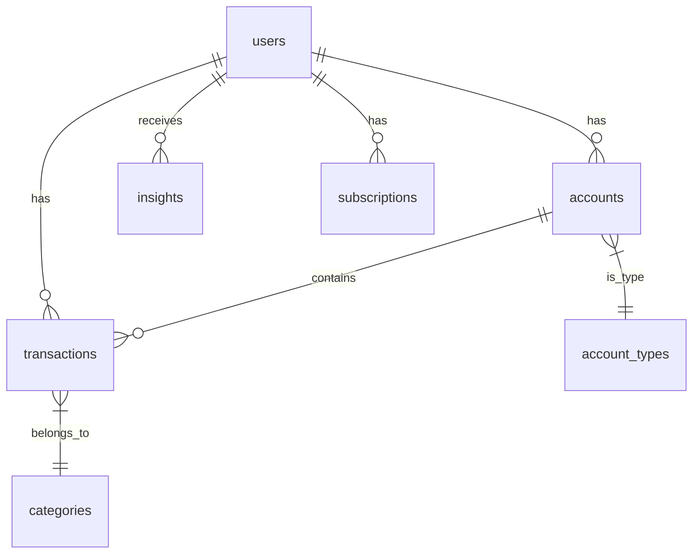

# Payfolio - Database Schema Design

## Overview
PostgreSQL database schema for Payfolio, designed for Supabase deployment.

---

## Entity Relationship Diagram



---

## Tables

### 1. users
Core user authentication and profile.

```sql
CREATE TABLE users (
    id UUID PRIMARY KEY DEFAULT gen_random_uuid(),
    email VARCHAR(255) UNIQUE NOT NULL,
    password_hash VARCHAR(255),
    full_name VARCHAR(255),
    phone VARCHAR(20),
    avatar_url TEXT,
    
    -- Subscription
    plan VARCHAR(20) DEFAULT 'free' CHECK (plan IN ('free', 'pro', 'business', 'enterprise')),
    plan_expires_at TIMESTAMPTZ,
    
    -- Preferences
    currency VARCHAR(3) DEFAULT 'INR',
    locale VARCHAR(10) DEFAULT 'en-IN',
    theme VARCHAR(10) DEFAULT 'dark',
    
    -- Metadata
    email_verified BOOLEAN DEFAULT FALSE,
    last_login_at TIMESTAMPTZ,
    created_at TIMESTAMPTZ DEFAULT NOW(),
    updated_at TIMESTAMPTZ DEFAULT NOW()
);

CREATE INDEX idx_users_email ON users(email);
```

---

### 2. account_types
Lookup table for account categories.

```sql
CREATE TABLE account_types (
    id SERIAL PRIMARY KEY,
    name VARCHAR(50) UNIQUE NOT NULL,
    icon VARCHAR(50),
    color VARCHAR(7),
    is_asset BOOLEAN DEFAULT TRUE -- FALSE for liabilities
);

-- Seed data
INSERT INTO account_types (name, icon, color, is_asset) VALUES
    ('bank', '🏦', '#3B82F6', TRUE),
    ('wallet', '📱', '#10B981', TRUE),
    ('investment', '📈', '#8B5CF6', TRUE),
    ('crypto', '₿', '#F59E0B', TRUE),
    ('credit_card', '💳', '#EF4444', FALSE),
    ('loan', '🏠', '#EF4444', FALSE),
    ('business', '🏢', '#3B82F6', TRUE),
    ('manual', '✏️', '#6B7280', TRUE);
```

---

### 3. accounts
Connected financial accounts.

```sql
CREATE TABLE accounts (
    id UUID PRIMARY KEY DEFAULT gen_random_uuid(),
    user_id UUID NOT NULL REFERENCES users(id) ON DELETE CASCADE,
    account_type_id INTEGER REFERENCES account_types(id),
    
    -- Display
    name VARCHAR(100) NOT NULL,
    institution VARCHAR(100), -- "HDFC Bank", "Zerodha", etc.
    logo_url TEXT,
    
    -- Balance
    current_balance DECIMAL(18, 2) DEFAULT 0,
    available_balance DECIMAL(18, 2),
    currency VARCHAR(3) DEFAULT 'INR',
    
    -- Connection
    connection_type VARCHAR(20) DEFAULT 'manual' CHECK (connection_type IN ('manual', 'api', 'csv', 'aggregator')),
    provider VARCHAR(50), -- "plaid", "aa", "zerodha", etc.
    provider_account_id VARCHAR(255),
    access_token_encrypted TEXT,
    
    -- Sync
    last_synced_at TIMESTAMPTZ,
    sync_status VARCHAR(20) DEFAULT 'ok' CHECK (sync_status IN ('ok', 'error', 'pending', 'disconnected')),
    sync_error TEXT,
    
    -- Metadata
    is_hidden BOOLEAN DEFAULT FALSE,
    is_archived BOOLEAN DEFAULT FALSE,
    created_at TIMESTAMPTZ DEFAULT NOW(),
    updated_at TIMESTAMPTZ DEFAULT NOW()
);

CREATE INDEX idx_accounts_user ON accounts(user_id);
CREATE INDEX idx_accounts_type ON accounts(account_type_id);
```

---

### 4. categories
Transaction categories for classification.

```sql
CREATE TABLE categories (
    id SERIAL PRIMARY KEY,
    name VARCHAR(50) NOT NULL,
    parent_id INTEGER REFERENCES categories(id),
    icon VARCHAR(50),
    color VARCHAR(7),
    is_income BOOLEAN DEFAULT FALSE
);

-- Seed data
INSERT INTO categories (name, icon, color, is_income) VALUES
    ('Salary', '💰', '#10B981', TRUE),
    ('Business Income', '🏢', '#10B981', TRUE),
    ('Investment Returns', '📈', '#10B981', TRUE),
    ('Freelance', '💻', '#10B981', TRUE),
    ('Food & Dining', '🍔', '#F59E0B', FALSE),
    ('Shopping', '🛒', '#8B5CF6', FALSE),
    ('Transportation', '🚗', '#3B82F6', FALSE),
    ('Bills & Utilities', '📱', '#EF4444', FALSE),
    ('Entertainment', '🎬', '#EC4899', FALSE),
    ('Health', '🏥', '#10B981', FALSE),
    ('Travel', '✈️', '#06B6D4', FALSE),
    ('Subscriptions', '📦', '#8B5CF6', FALSE),
    ('Transfer', '↔️', '#6B7280', FALSE),
    ('Other', '📌', '#6B7280', FALSE);
```

---

### 5. transactions
All financial transactions across accounts.

```sql
CREATE TABLE transactions (
    id UUID PRIMARY KEY DEFAULT gen_random_uuid(),
    user_id UUID NOT NULL REFERENCES users(id) ON DELETE CASCADE,
    account_id UUID NOT NULL REFERENCES accounts(id) ON DELETE CASCADE,
    category_id INTEGER REFERENCES categories(id),
    
    -- Core
    amount DECIMAL(18, 2) NOT NULL,
    currency VARCHAR(3) DEFAULT 'INR',
    transaction_type VARCHAR(20) CHECK (transaction_type IN ('credit', 'debit', 'transfer')),
    
    -- Details
    description TEXT,
    merchant_name VARCHAR(255),
    merchant_logo TEXT,
    
    -- Classification
    is_recurring BOOLEAN DEFAULT FALSE,
    is_subscription BOOLEAN DEFAULT FALSE,
    tags TEXT[], -- Array of user tags
    
    -- Source
    provider_transaction_id VARCHAR(255),
    raw_data JSONB, -- Original transaction from provider
    
    -- AI
    ai_category_confidence DECIMAL(3, 2), -- 0.00 to 1.00
    ai_insights JSONB,
    
    -- Dates
    transaction_date DATE NOT NULL,
    posted_date DATE,
    created_at TIMESTAMPTZ DEFAULT NOW(),
    updated_at TIMESTAMPTZ DEFAULT NOW()
);

CREATE INDEX idx_transactions_user ON transactions(user_id);
CREATE INDEX idx_transactions_account ON transactions(account_id);
CREATE INDEX idx_transactions_date ON transactions(transaction_date DESC);
CREATE INDEX idx_transactions_category ON transactions(category_id);
```

---

### 6. assets
Manual assets (real estate, gold, etc.).

```sql
CREATE TABLE assets (
    id UUID PRIMARY KEY DEFAULT gen_random_uuid(),
    user_id UUID NOT NULL REFERENCES users(id) ON DELETE CASCADE,
    
    name VARCHAR(100) NOT NULL,
    asset_type VARCHAR(50) CHECK (asset_type IN ('real_estate', 'vehicle', 'gold', 'collectible', 'other')),
    
    current_value DECIMAL(18, 2) NOT NULL,
    purchase_value DECIMAL(18, 2),
    purchase_date DATE,
    currency VARCHAR(3) DEFAULT 'INR',
    
    notes TEXT,
    
    created_at TIMESTAMPTZ DEFAULT NOW(),
    updated_at TIMESTAMPTZ DEFAULT NOW()
);

CREATE INDEX idx_assets_user ON assets(user_id);
```

---

### 7. liabilities
Loans, EMIs, credit lines.

```sql
CREATE TABLE liabilities (
    id UUID PRIMARY KEY DEFAULT gen_random_uuid(),
    user_id UUID NOT NULL REFERENCES users(id) ON DELETE CASCADE,
    linked_account_id UUID REFERENCES accounts(id),
    
    name VARCHAR(100) NOT NULL,
    liability_type VARCHAR(50) CHECK (liability_type IN ('home_loan', 'car_loan', 'personal_loan', 'credit_card', 'emi', 'bnpl', 'other')),
    
    principal_amount DECIMAL(18, 2),
    current_balance DECIMAL(18, 2) NOT NULL,
    interest_rate DECIMAL(5, 2),
    currency VARCHAR(3) DEFAULT 'INR',
    
    emi_amount DECIMAL(18, 2),
    emi_day INTEGER CHECK (emi_day BETWEEN 1 AND 31),
    start_date DATE,
    end_date DATE,
    
    lender VARCHAR(100),
    notes TEXT,
    
    created_at TIMESTAMPTZ DEFAULT NOW(),
    updated_at TIMESTAMPTZ DEFAULT NOW()
);

CREATE INDEX idx_liabilities_user ON liabilities(user_id);
```

---

### 8. insights
AI-generated financial insights.

```sql
CREATE TABLE insights (
    id UUID PRIMARY KEY DEFAULT gen_random_uuid(),
    user_id UUID NOT NULL REFERENCES users(id) ON DELETE CASCADE,
    
    insight_type VARCHAR(50) NOT NULL, -- 'cash_runway', 'spending_spike', 'subscription_alert', etc.
    title VARCHAR(255) NOT NULL,
    description TEXT NOT NULL,
    
    severity VARCHAR(20) DEFAULT 'info' CHECK (severity IN ('info', 'warning', 'alert', 'success')),
    priority INTEGER DEFAULT 5 CHECK (priority BETWEEN 1 AND 10),
    
    data JSONB, -- Structured data for the insight
    cta_text VARCHAR(100), -- "View Details", "Optimize Now"
    cta_link VARCHAR(255),
    
    is_read BOOLEAN DEFAULT FALSE,
    is_dismissed BOOLEAN DEFAULT FALSE,
    
    valid_from TIMESTAMPTZ DEFAULT NOW(),
    valid_until TIMESTAMPTZ,
    
    created_at TIMESTAMPTZ DEFAULT NOW()
);

CREATE INDEX idx_insights_user ON insights(user_id);
CREATE INDEX idx_insights_unread ON insights(user_id) WHERE is_read = FALSE;
```

---

### 9. subscriptions
User billing and subscription management.

```sql
CREATE TABLE subscriptions (
    id UUID PRIMARY KEY DEFAULT gen_random_uuid(),
    user_id UUID UNIQUE NOT NULL REFERENCES users(id) ON DELETE CASCADE,
    
    plan VARCHAR(20) NOT NULL DEFAULT 'free',
    status VARCHAR(20) DEFAULT 'active' CHECK (status IN ('active', 'cancelled', 'past_due', 'trialing')),
    
    -- Stripe/Razorpay
    stripe_customer_id VARCHAR(255),
    stripe_subscription_id VARCHAR(255),
    razorpay_customer_id VARCHAR(255),
    razorpay_subscription_id VARCHAR(255),
    
    -- Billing
    billing_cycle VARCHAR(20) DEFAULT 'monthly' CHECK (billing_cycle IN ('monthly', 'yearly')),
    current_period_start TIMESTAMPTZ,
    current_period_end TIMESTAMPTZ,
    
    -- Limits
    max_accounts INTEGER DEFAULT 2,
    
    created_at TIMESTAMPTZ DEFAULT NOW(),
    updated_at TIMESTAMPTZ DEFAULT NOW()
);

CREATE INDEX idx_subscriptions_stripe ON subscriptions(stripe_customer_id);
```

---

### 10. net_worth_history
Daily snapshots of net worth for historical tracking.

```sql
CREATE TABLE net_worth_history (
    id UUID PRIMARY KEY DEFAULT gen_random_uuid(),
    user_id UUID NOT NULL REFERENCES users(id) ON DELETE CASCADE,
    
    snapshot_date DATE NOT NULL,
    
    total_assets DECIMAL(18, 2) NOT NULL,
    total_liabilities DECIMAL(18, 2) NOT NULL,
    net_worth DECIMAL(18, 2) NOT NULL,
    
    breakdown JSONB, -- {"banks": 100000, "investments": 500000, ...}
    
    created_at TIMESTAMPTZ DEFAULT NOW(),
    
    UNIQUE(user_id, snapshot_date)
);

CREATE INDEX idx_networth_user_date ON net_worth_history(user_id, snapshot_date DESC);
```

---

## Views

### v_user_portfolio
Aggregated portfolio view per user.

```sql
CREATE VIEW v_user_portfolio AS
SELECT 
    u.id AS user_id,
    u.full_name,
    u.plan,
    
    -- Assets
    COALESCE(SUM(CASE WHEN at.is_asset THEN a.current_balance ELSE 0 END), 0) AS total_in_accounts,
    COALESCE(SUM(CASE WHEN at.is_asset = FALSE THEN a.current_balance ELSE 0 END), 0) AS total_credit_used,
    COALESCE((SELECT SUM(current_value) FROM assets WHERE user_id = u.id), 0) AS total_manual_assets,
    COALESCE((SELECT SUM(current_balance) FROM liabilities WHERE user_id = u.id), 0) AS total_liabilities,
    
    -- Calculated
    (
        COALESCE(SUM(CASE WHEN at.is_asset THEN a.current_balance ELSE 0 END), 0) +
        COALESCE((SELECT SUM(current_value) FROM assets WHERE user_id = u.id), 0) -
        COALESCE((SELECT SUM(current_balance) FROM liabilities WHERE user_id = u.id), 0)
    ) AS net_worth,
    
    COUNT(DISTINCT a.id) AS connected_accounts
    
FROM users u
LEFT JOIN accounts a ON a.user_id = u.id AND a.is_archived = FALSE
LEFT JOIN account_types at ON a.account_type_id = at.id
GROUP BY u.id;
```

---

## Functions

### Calculate Net Worth
```sql
CREATE OR REPLACE FUNCTION calculate_net_worth(p_user_id UUID)
RETURNS DECIMAL(18, 2) AS $$
DECLARE
    v_assets DECIMAL(18, 2);
    v_manual_assets DECIMAL(18, 2);
    v_liabilities DECIMAL(18, 2);
BEGIN
    -- Sum from connected accounts (assets only)
    SELECT COALESCE(SUM(a.current_balance), 0)
    INTO v_assets
    FROM accounts a
    JOIN account_types at ON a.account_type_id = at.id
    WHERE a.user_id = p_user_id 
      AND at.is_asset = TRUE 
      AND a.is_archived = FALSE;
    
    -- Sum manual assets
    SELECT COALESCE(SUM(current_value), 0)
    INTO v_manual_assets
    FROM assets
    WHERE user_id = p_user_id;
    
    -- Sum liabilities
    SELECT COALESCE(SUM(current_balance), 0)
    INTO v_liabilities
    FROM liabilities
    WHERE user_id = p_user_id;
    
    RETURN v_assets + v_manual_assets - v_liabilities;
END;
$$ LANGUAGE plpgsql;
```

### Daily Net Worth Snapshot (Scheduled)
```sql
CREATE OR REPLACE FUNCTION snapshot_net_worth()
RETURNS void AS $$
BEGIN
    INSERT INTO net_worth_history (user_id, snapshot_date, total_assets, total_liabilities, net_worth, breakdown)
    SELECT 
        u.id,
        CURRENT_DATE,
        COALESCE(SUM(CASE WHEN at.is_asset THEN a.current_balance ELSE 0 END), 0) +
            COALESCE((SELECT SUM(current_value) FROM assets WHERE user_id = u.id), 0),
        COALESCE((SELECT SUM(current_balance) FROM liabilities WHERE user_id = u.id), 0),
        calculate_net_worth(u.id),
        jsonb_build_object(
            'banks', COALESCE(SUM(CASE WHEN at.name = 'bank' THEN a.current_balance ELSE 0 END), 0),
            'investments', COALESCE(SUM(CASE WHEN at.name = 'investment' THEN a.current_balance ELSE 0 END), 0),
            'crypto', COALESCE(SUM(CASE WHEN at.name = 'crypto' THEN a.current_balance ELSE 0 END), 0),
            'wallets', COALESCE(SUM(CASE WHEN at.name = 'wallet' THEN a.current_balance ELSE 0 END), 0)
        )
    FROM users u
    LEFT JOIN accounts a ON a.user_id = u.id AND a.is_archived = FALSE
    LEFT JOIN account_types at ON a.account_type_id = at.id
    GROUP BY u.id
    ON CONFLICT (user_id, snapshot_date) DO UPDATE SET
        total_assets = EXCLUDED.total_assets,
        total_liabilities = EXCLUDED.total_liabilities,
        net_worth = EXCLUDED.net_worth,
        breakdown = EXCLUDED.breakdown;
END;
$$ LANGUAGE plpgsql;
```

---

## Row Level Security (Supabase)

```sql
-- Enable RLS
ALTER TABLE users ENABLE ROW LEVEL SECURITY;
ALTER TABLE accounts ENABLE ROW LEVEL SECURITY;
ALTER TABLE transactions ENABLE ROW LEVEL SECURITY;
ALTER TABLE assets ENABLE ROW LEVEL SECURITY;
ALTER TABLE liabilities ENABLE ROW LEVEL SECURITY;
ALTER TABLE insights ENABLE ROW LEVEL SECURITY;
ALTER TABLE subscriptions ENABLE ROW LEVEL SECURITY;
ALTER TABLE net_worth_history ENABLE ROW LEVEL SECURITY;

-- Users can only see their own data
CREATE POLICY "Users can view own data" ON users
    FOR ALL USING (auth.uid() = id);

CREATE POLICY "Users can view own accounts" ON accounts
    FOR ALL USING (auth.uid() = user_id);

CREATE POLICY "Users can view own transactions" ON transactions
    FOR ALL USING (auth.uid() = user_id);

CREATE POLICY "Users can view own assets" ON assets
    FOR ALL USING (auth.uid() = user_id);

CREATE POLICY "Users can view own liabilities" ON liabilities
    FOR ALL USING (auth.uid() = user_id);

CREATE POLICY "Users can view own insights" ON insights
    FOR ALL USING (auth.uid() = user_id);

CREATE POLICY "Users can view own subscription" ON subscriptions
    FOR ALL USING (auth.uid() = user_id);

CREATE POLICY "Users can view own net worth history" ON net_worth_history
    FOR ALL USING (auth.uid() = user_id);
```

---

## Supabase Migration File

Save as `supabase/migrations/001_initial_schema.sql` and run:
```bash
supabase db push
```
